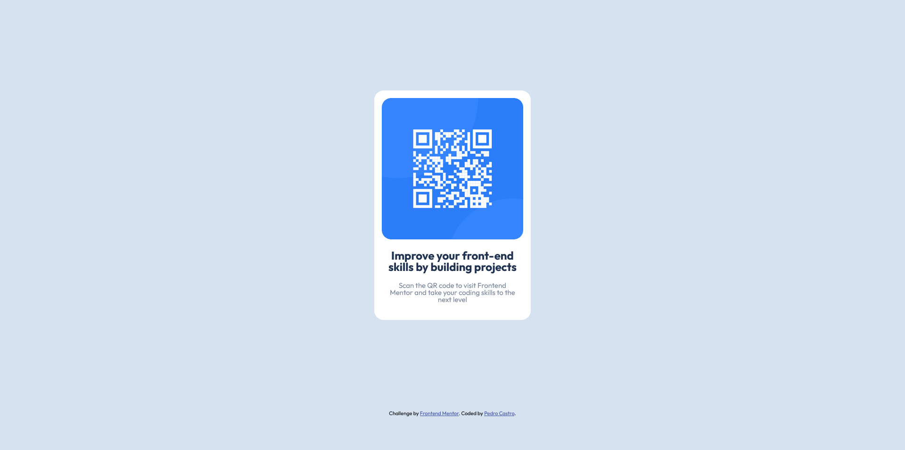

# Frontend Mentor - QR code component solution

Essa é uma solução para o projeto [QR code component challenge on Frontend Mentor](https://www.frontendmentor.io/challenges/qr-code-component-iux_sIO_H).

## Overview

### Screenshot

Desafio simples para iniciantes, utilizando HTML e CSS!

### Links

- Solução URL: [Frontend Mentor](https://www.frontendmentor.io/solutions/qr-code-component-JLpKwPe8az)
- Live Site URL: [Live](https://pedrodcastro.github.io/qr-code-component-main/)

## Author

- Frontend Mentor - [@pedrodcastro](https://www.frontendmentor.io/profile/pdaugz)
